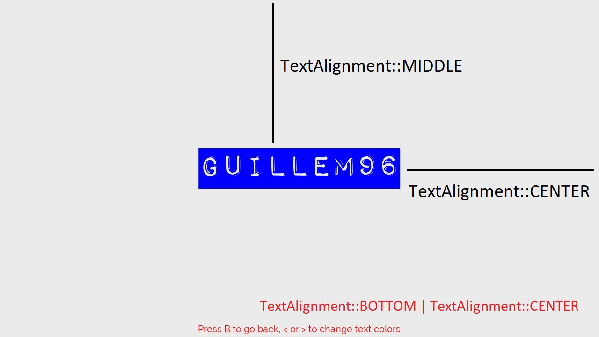
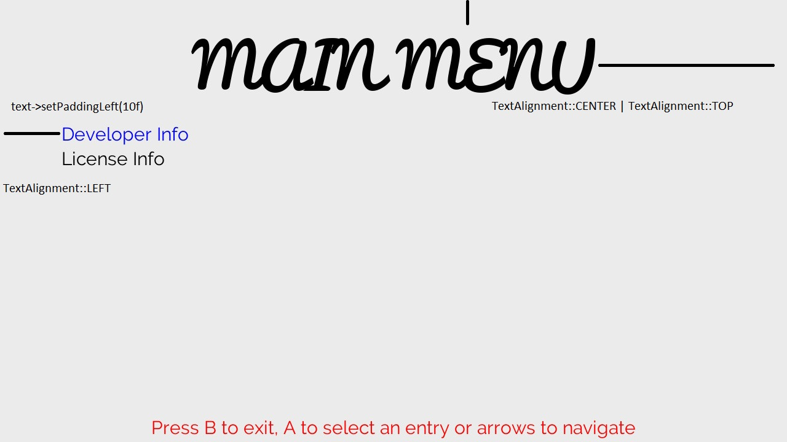

# Font Manager

## Font manager related objects
### Font

Load a ttf font.

```                   /* (font_path, font_size) */
Font* font = new Font("romfs:/Pacifico.ttf", 100);
```

### Text

Possiblility to align text to screen automatically only using flags.
It is a bit ugly but I am not a designer, I only want to demonstrate the functionality.




Possiblity to draw text with an specific ttf font

```cpp
m_titleFont = new Font("romfs:/Pacifico.ttf", 100);
Text *title = new Text("MAIN MENU",                                    // Text to render 
                        m_titleFont,                                   // Specify the font
                        Vector2(),                                     // Text position, in this case is useless because vertical and horizontal alignment is set
                        Colors::BLACK,                                 // Text color
                        TextAlignFlags::TOP | TextAlignFlags::CENTER); // Set the alignment
m_fontManager->addText(title);
```

## Font Manager API

Take a look to [FontManager.h](src/include/font-manager/FontManager.h)

```cpp
// Do not care about constructors, ComponentFactory takes care of them

// Add text in order to be rendered on the draw function
// Once the texts are added FontManager will be the responsible of free them
void addText(Text *t);

// Flushes the text to screen
// Should be called each frame
void draw();

// Deinitialize ttf_font and free all TextList
void destroy();
```

## How to use FontManager

In the build method of an IScreen you are able to create the FontManager object using the following instruction: ``m_screen->factory()->createFontManager((GfxScreen *)m_screen)``, where ``m_screen`` is the reference to our GfxScrenManager.
Be careful because FontManager needs a reference to a GfxScreen, so it means that you won't be able to create a FontManager object when you are working with a ConsoleScreen.

*Example:*

```cpp
// Create it using the ComponentFactory at build method
void MyScreen::build()
{
  // Create the FontManager component using a factory
  m_fontManager = m_screen->factory()->createFontManager((GfxScreen *)m_screen);
  m_fontManager->init();

  // Build some text 
  m_message = new Text("Guillem96", m_msgFont, Vector2(), Colors::BLACK, TextAlignFlags::MIDDLE | TextAlignFlags::CENTER);
  m_fontManager->addText(m_message);
}

void MyScreen::update()
{
    if(/* any condition ypu want */)
      m_message->setColor(Colors::RED)
}

void MyScreen::draw()
{
    m_fontManager->draw(); // Do not forget to call draw or you will get the screen empty
}

void MyScreen::destroy()
{
  m_fontManager->destroy();
  delete m_fontManager;
}
```