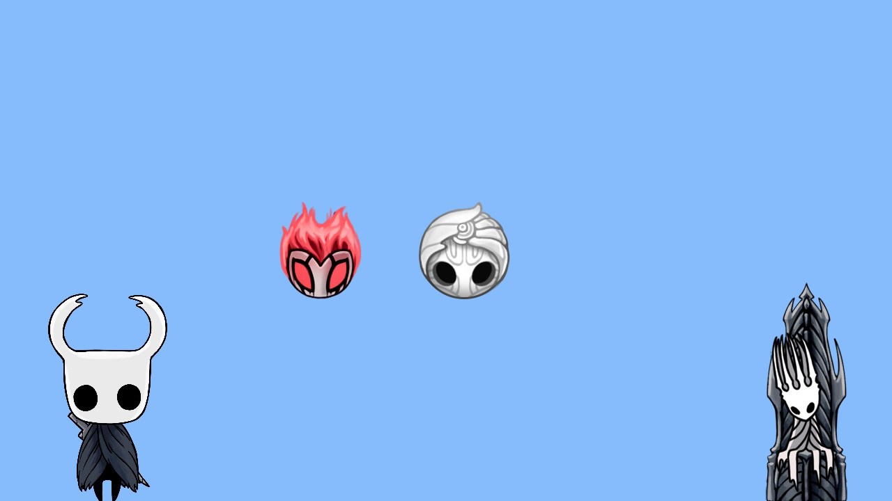

# Sprite Renderer

## Sprites

``Sprite`` is an ``IDrawable`` object. That allows you to store all related data of an image/sprite...

In order to generate an Sprite you have to invoke its constructor, and optionally set the paddings.

```cpp
Sprite *sprite = new Sprite("romfs:/img/.png", Vector2(), Vector2(1.0f), ScreenAlignFlags::BOTTOM | ScreenAlignFlags::RIGHT);
sprite->setPaddingBottom(0.0f);
sprite->setPaddingRight(20.0f);
```

See more about sprites [here](../include/sprite-renderer/Sprite.h).

## Sprite Renderer API

Take a look to [SpriteRenderer.h](../include/sprite-renderer/SpriteRenderer.h)

```cpp
// Do not care about constructors, ComponentFactory takes care of them

// Add an Sprite in order to be rendered on the following frames
// When the sprite is added its SDL_Texture is generated, so you now can get the sprite size using sprite->getSize();
void addSprite(Sprite *s);

// Flushes the Sprites to screen
// Should be called each frame
void draw();

// Deinitialize SDL_Video and free all Sprites
void destroy();
```

## How to use SpriteRenderer

In the build method of an IScreen you are able to create the SpriteRenderer object using the following instruction: ``m_screen->factory()->createSpriteRenderer((GfxScreen *)m_screen)``, where ``m_screen`` is the reference to our GfxScreenManager.
Be careful because SpriteRenderer needs a reference to a GfxScreen, so it means that you won't be able to create a SpriteRenderer object when you are working with a ConsoleScreen.

*Example:*

```cpp
void MyScreen::build()
{
    // All components can be combined
    // In this case we use input manager because we need one way to exit the app
    m_inputManager = m_screen->factory()->createInputManager();
    m_inputManager->init();

    // Create the InputManager component using a factory
    m_spriteRenderer = m_screen->factory()->createSpriteRenderer((GfxScreen *)m_screen);
    m_spriteRenderer->init();

    Sprite *hk = new Sprite("romfs:/img/latest.png", 
                              Vector2(), // Position is not important because alignments 
                              Vector2(0.25f), // Reduce image size
                              ScreenAlignFlags::BOTTOM | ScreenAlignFlags::LEFT);
    hk->setPaddingBottom(-20.0f);
    hk->setPaddingLeft(20.0f);
    
    m_spriteRenderer->addSprite(hk);
}

void MyScreen::destroy()
{
    m_inputManager->destroy();
    delete m_inputManager;

    m_spriteRenderer->destroy();
    delete m_spriteRenderer;
}

void MyScreen::draw()
{
    m_spriteRenderer->draw();
}
```

Result of the *examples/gfx-screen/using-sprites* example;

